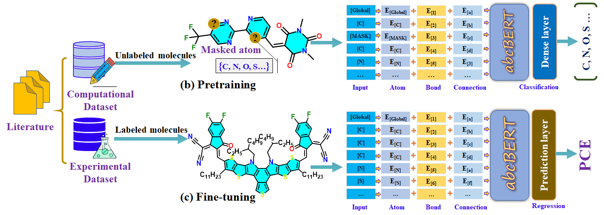
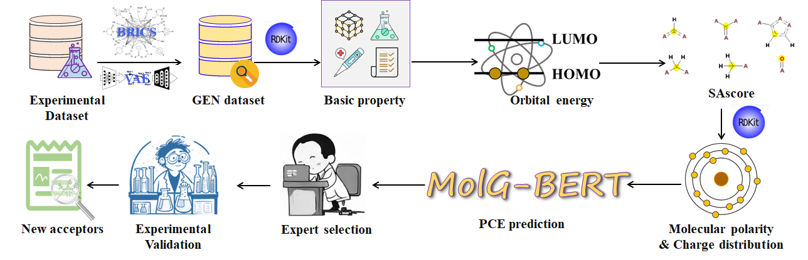

# <u>DeepAcceptor</u>

### **Computational design and screening of acceptor materials for organic solar cells**



## <u>Motivation</u>

It is a time-consuming and costly process to develop affordable and high-performance organic photovoltaic materials. Developing reliable computational methods to predict the power conversion efficiency (PCE) is crucial to triage unpromising molecules in large-scale databases and accelerate the material discovery process. In this study, a deep learning-based framework (DeepAcceptor) has been built to design and discover high-efficient small molecule acceptor materials. Specifically, an experimental dataset was constructed by collecting data from publications. Then, a BERT-based model was customized to predict PCEs by taking fully advantages of the atom, bond, connection information in molecular structures of acceptors, and this customized architecture is termed as abcBERT. The computation molecules and experimental molecules were used to pre-train and fine-tune the model, respectively. The molecular graph was used as the input and the computation molecules and experimental molecules were used to pretrain and finetune the model, respectively. In sum, DeepAcceptor is a promising method to predict the PCE and speed up the discovery of high-performance acceptor materials.

------


### <u>Depends</u>

We recommend to use [conda](https://conda.io/docs/user-guide/install/download.html) and [pip](https://pypi.org/project/pip/).

[python3.8](https://www.python.org/download) 		

[Anaconda](https://www.anaconda.com/)

**By using the *environment.yml* file, it will install all the required packages.**

```
git clone --depth=1 https://github.com/jinysun/deepacceptor.git
cd deepacceptor
conda env create -f environment.yml
conda activate deepacceptor
```

------

## <u>Usage</u>

| The code of abcBERT is as follows.                           |
| ------------------------------------------------------------ |
| -- [pretrain](https://github.com/JinYSun/DeepAcceptor/blob/master/abcBERT/pretrain.py): contains the codes for masked atom prediction pre-training task. |
| -- [regression](https://github.com/JinYSun/DeepAcceptor/blob/master/abcBERT/regression.py): contain the code for fune-tuning on specified tasks |
| -- [dataset](https://github.com/JinYSun/DeepAcceptor/blob/master/abcBERT/dataset.py): contain the code to building dataset for pre-traing and fine-tuning |
| -- [utils](https://github.com/JinYSun/DeepAcceptor/blob/master/abcBERT/utils.py): contain the code to convert molecules to graphs |
| --[predict](https://github.com/JinYSun/DeepAcceptor/blob/master/abcBERT/predict.py): contain the code for predict the properties |
| --[Demo](https://github.com/JinYSun/DeepAcceptor/tree/master/abcBERT/Demo):  contain the code to show how the model works |

------


## <u>Data pre-processing</u>

abcBERT is a model for predicting PCE based on molecular graph,  so we need to convert SMILES strings to Graph. The related method is  shown in [`deepacceptor/utils.py`](https://github.com/JinYSun/DeepAcceptor/blob/master/abcBERT/utils.py)

First, put the test file in the file data/reg/.

Then, run the utils.py as follows.


    import pandas as pd 
    import utils 
    utils.pretrainprocess()
    utils.processtrain()
    utils.processtest()
    utils.processtval()

or use the command line as follows

```
cd abcBERT
python utils.py
```

------


## <u>Model training</u>

1. #### Pre-train the model

   The pre-training process can be completed after pre-processing the data.

   ```
   import pretrain
   pretrain.main()
   ```

   or use the command line as follows

   ```
   cd abcBERT
   #pre-process the data for pretraining
   python -c "import utils; utils.pretrainprocess()"
   
   #pretraining
   python pretrain.py
   ```

   

2. #### Fine-tune the model

   The training process can be completed after pre-processing the training/test/validation set and pre-training the model.
   
   
       import regression
       from regression import *
       result =[]
       r2_list = []
       seed = 12
       r2,prediction_val,prediction_test= main(seed)

or use the command line as follows

```
    cd abcBERT
    #pre-process the data for training/test/validation
    python -c "import utils; utils.processtrain()"
    python -c "import utils; utils.processtest()"
    python -c "import utils; utils.processtval()"
    
    # Fine-tuning the model
    python regression.py
```


------


## <u>Predicting PCE of large-scale database</u>

The PCE prediction is obtained by feeding the the processed molecules into the already trained abcBERT model with [predict.py](https://github.com/JinYSun/DeepAcceptor/blob/master/abcBERT/predict.py) 

        #Pre-process the test data
        import utils
        from utils import *
        utils.processtest()
    
        # Prediction on large-scale dataset
        import predict
        from predict import *
        np.set_printoptions(threshold=sys.maxsize)
        prediction_val= main()

or use the command line as follows

```
    cd abcBERT
    
    # pre-process the data
    python -c "import utils; utils.processtest()"
    
    # prediction on large-scale dataset
    python predict.py
```

## <u>Predicting PCE  of single molecule</u>

```
    import predictbysmiles
    from predictbysmiles import *
    # prediction without any pre-process
    prediction_val = main ('CCCCCCCCC1=CC=C(C2(C3=CC=C(CCCCCCCC)C=C3)C3=CC4=C(C=C3C3=C2C2=C(C=C(C5=CC=C(/C=C6/C(=O)C7=C(C=CC=C7)C6=C(C#N)C#N)C6=NSN=C56)S2)S3)C(C2=CC=C(CCCCCCCC)C=C2)(C2=CC=C(CCCCCCCC)C=C2)C2=C4SC3=C2SC(C2=CC=C(/C=C4\C(=O)C5=C(C=CC=C5)C4=C(C#N)C#N)C4=NSN=C24)=C3)C=C1')
```

or use the command line as follows

```
    cd abcBERT
    # prediction without any pre-process
    python -c "import predictbysmiles; predictbysmiles.main('CCCCCCCCC1=CC=C(C2(C3=CC=C(CCCCCCCC)C=C3)C3=CC4=C(C=C3C3=C2C2=C(C=C(C5=CC=C(/C=C6/C(=O)C7=C(C=CC=C7)C6=C(C#N)C#N)C6=NSN=C56)S2)S3)C(C2=CC=C(CCCCCCCC)C=C2)(C2=CC=C(CCCCCCCC)C=C2)C2=C4SC3=C2SC(C2=CC=C(/C=C4\C(=O)C5=C(C=CC=C5)C4=C(C#N)C#N)C4=NSN=C24)=C3)C=C1')"
```


**The example codes for prediction is included in the [test.ipynb](https://github.com/JinYSun/DeepAcceptor/blob/master/abcBERT/test.ipynb)**

## <u>Demo</u>

 The [example.ipynb](https://github.com/JinYSun/DeepAcceptor/blob/master/abcBERT/Demo/example.ipynb) was used to show the whole process of abcBERT. The files in Demo were used to test that the codes work well. The parameters (such as epochs, dataset size) were set to small numbers to show how the abcBERT worked.

------


## <u>Designing and Screening</u>



### Molecular generation

[BRICS](https://github.com/JinYSun/DeepAcceptor/blob/master/screen/general.py)+[VAE](https://github.com/JinYSun/DeepAcceptor/tree/master/screen/vae): A fragments-based molecule design framework was built by using the  breaking of retrosynthetically interesting chemical substructures  (BRICS) algorithm and variational autoencoder (VAE) to obtain a database with specific potential molecular properties. 

### Basic properties

[Basic properties](https://github.com/JinYSun/DeepAcceptor/blob/master/screen/properties.py): The Gen database was screened with some basic properties such as molecular size, log*P*, the number of H-bond acceptors and donors, number of rotatable bonds. These properties were calculated by using RDKit. 

### HOMO & LUMO matching

[GNN](https://github.com/JinYSun/DeepAcceptor/tree/master/screen/HOMO_LUMO) was trained on a NFA dataset including HOMO and LUMO  computing by DFT. The dataset including 51000 NFAs was splited randomly  with a ratio of 8:1:1. The MAE and R2 of the predicted HOMO are 0.052  and 0.972. 

## SAscore

[SAscore](https://github.com/JinYSun/DeepAcceptor/tree/master/screen/SAscore)  was used to synthetic accessibility and complexity. 

### **Molecular polarities and charge distribution**

[Properties](https://github.com/JinYSun/DeepAcceptor/blob/master/screen/properties.py) related to molecular polarity and charge distribution were calculated by RDKit. 

------


## <u>Discussion</u> 

The [Discussion](https://github.com/JinYSun/Deepacceptor/tree/main/discussion) folder contains the scripts for evaluating the PCE prediction performance.  We compared sevaral common methods widely used in molecular property prediction, such as [MolCLR](https://github.com/JinYSun/DeepAcceptor/blob/main/discussion/MolCLR.py) [GNN](https://github.com/JinYSun/DeepAcceptor/blob/main/discussion/GNN.py),[RF](https://github.com/JinYSun/DeepAcceptor/blob/main/discussion/RF.py), [ANN](https://github.com/JinYSun/Deepacceptor/blob/main/discussion/ANN.py),[QDF](https://github.com/JinYSun/DeepAcceptor/blob/main/discussion/QDF.py).

## <u>Cite</u>

Sun, J., Li, D., Zou, J. *et al.* Accelerating the discovery of acceptor materials for organic solar cells by deep learning. *npj Comput Mater* **10**, 181 (2024). https://doi.org/10.1038/s41524-024-01367-7

## <u>Contact</u>

Jinyu Sun. E-mail: [jinyusun@csu.edu.cn](mailto:jinyusun@csu.edu.cn)
