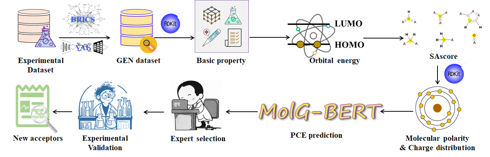

# DeepAcceptor

### **Computational design and screening of acceptor materials for organic solar cells**

## <u>Motivation</u>

It is a time-consuming and costly process to developing affordable and high-performance organic photovoltaic materials. Developing reliable computational methods to predict the power conversion efficiency (PCE) is crucial to triage unpromising molecules in large-scale database and accelerate the material discovery process. In this study, a deep-learning based framework (DeepAcceptor) has been built to design and discover high-efficient small molecule acceptor materials. Specifically, an experimental dataset was built by collecting data from publications. Then, a BERT-based model was used to predict PCEs. The molecular graph was used as the input and the computation molecules and experimental molecules were used to pretrain and finetune the model, respectively. In sum, DeepAcceptor is a promising method to predict the PCE and speed up the discovery of high-performance acceptor materials.

## <u>Depends</u>

We recommend to use [conda](https://conda.io/docs/user-guide/install/download.html) and [pip](https://pypi.org/project/pip/).

[tensorflow](www.tensorflow.org)==2.3.0, 

[rdkit](https://rdkit.org/)==2020.03.2, 

[numpy](https://numpy.org/)==1.18.5, 

[pandas](http://pandas.pydata.org/)==1.1.0, 

[openbabel](http://openbabel.org/wiki/Main_Page)==2.3.1

**By using the *environment.yml* file, it will install all the required packages.**

''' shell
git clone https://github.com/jinysun/deepacceptor.git

cd DeepAcceptor

conda env create -f environment.yml

conda activate deepacceptor
'''

## <u>Usage</u>

-- pretrain:
    contains the codes for masked atom prediction pre-training task.
    
-- regression:
    contain the code for fune-tuning on specified tasks
    
-- dataset:
    contain the code to building dataset for pre-traing and fine-tuning 
    
-- utils:
    contain the code to convert molecules to graphs
    
 --data:
     dataset used for pretraining and fine-tuning 

## <u>Discussion</u> 

The [Discussion](https://github.com/JinYSun/Deepacceptor/tree/main/discussion) folder contains the scripts for evaluating the PCE prediction performance.  We compared sevaral common methods widely used in molecular property prediction, such as [MolCLR](https://github.com/JinYSun/DeepAcceptor/blob/main/discussion/MolCLR.py) [GNN](https://github.com/JinYSun/DeepAcceptor/blob/main/discussion/GNN.py),[RF](https://github.com/JinYSun/DeepAcceptor/blob/main/discussion/RF.py), [ANN](https://github.com/JinYSun/Deepacceptor/blob/main/discussion/ANN.py),[QDF](https://github.com/JinYSun/DeepAcceptor/blob/main/discussion/QDF.py).

## <u>Screen</u>

## <u>Contact</u>

Jinyu Sun. E-mail: [jinyusun@csu.edu.cn](mailto:jinyusun@csu.edu.cn)
