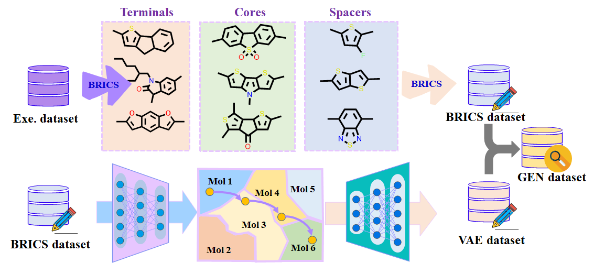

<h3 align="center">

 A deep learning-based process for the designing and screening of small molecule acceptor materials.
 </h3>

## process

**Figure 1**

To show the performance of DeepAcceptor, a large-scale acceptor materials screening process was built as shown in Figure 1. 

## Molecular generation

**Figure 2**

A fragments-based molecule design framework was built by using the breaking of retrosynthetically interesting chemical substructures (BRICS) algorithm and variational autoencoder (VAE) to obtain a database with specific potential molecular properties. The detailed process is shown in Figure 2. The fragments were generated from existing experimental molecules, as similar structures often have similar properties. In this study, the framework was used to generate NFA molecules. Specifically, the BRICS algorithm  was used to decomposed experimental molecules into constituent fragments, these substructures were divided into terminals (T), cores (C) and spacers (S) according to molecular weights and numbers of groups to be attached. Then, new molecules were generated by recomposing the fragments in the order of T-S-C-S-T and S-C-S-T by BRICS algorithm. Besides, to generate more diverse structures and explore more efficient fragments, the newly generated dataset by BRICS was used as the input of the VAE. Specifically, all the SMILES were converted into SELFIES, which is a 100% robust molecular representation. Then strings of alphabet were encoded into vectors using recurrent neural networks (RNNs). An encoder along with a decoder RNN was used to perform sequence-to-sequence learning. 500 thousand molecules were used to train the VAE and then the trained model was used to generated new molecules. The encoder was built by three fully connected layers. The dimension of the layers is 100. The rectified linear unit (ReLU) was used as the activation function. The decoder was built by four fully connected hidden layers with the dimension of 50 and activation function of ReLU. A probability distribution for all possible symbols at each position was defined by the final layer of the decoder in the SELFIES string with the activation function of sigmoid. Finally, the generated SELFIES were converted into SMILES, and the Gen database was formed by the SMILES generated by BRICS and VAE. T

## Basic properties

The Gen database was screened with some basic properties such as molecular size, log*P*, the number of H-bond acceptors and donors, number of rotatable bonds. These properties were calculated by using RDKit. The cutoff values were set according to the properties of the high-performance acceptors (PCE > 10%) in experimental dataset.

## HOMO & LUMO matching

The PM6 was chosen as the donor, and the candidates were screened to match the highest occupied molecular orbital (HOMO) and lowest unoccupied molecular orbital (LUMO) of PM6. The HOMO and LUMO of PM6 are -5.45 and -3.65eV. the HOMO offset (ΔHOMO) and LUMO offset (ΔLUMO) between the PM6 and NFA are important for the devices to reach great performance. The molecularGNN was trained on a NFA dataset including HOMO and LUMO computing by DFT. The dataset including 51000 NFAs was splited randomly with a ratio of 8:1:1. The MAE and R2 of the predicted HOMO are 0.052 and 0.972. The MAE and R2 of the predicted LUMO are 0.055 and 0.971. The trained model was used to predict the HOMO and LUMO of the candidates.

## SAscore 

SAscore  was used to synthetic accessibility and complexity. SAscore is a useful way to measure synthetic accessibility by analyzing the fragment frequency of occurrence in PubChem and the presence of non-standard structural features that are unfavorable to synthesis. Molecules with SAscore < 7 were obtained in this way. 

## **Molecular polarities and charge distribution**

properties related to molecular polarity and charge distribution were calculated by RDKit. The  polar surface area of a molecule based upon fragments, the  number of valence electrons the molecule has, Labute's  Approximate Surface Area ,   maximum  EState index  were used to screen the molecules.  

## Contact

jinyusun@csu.edu.cn
